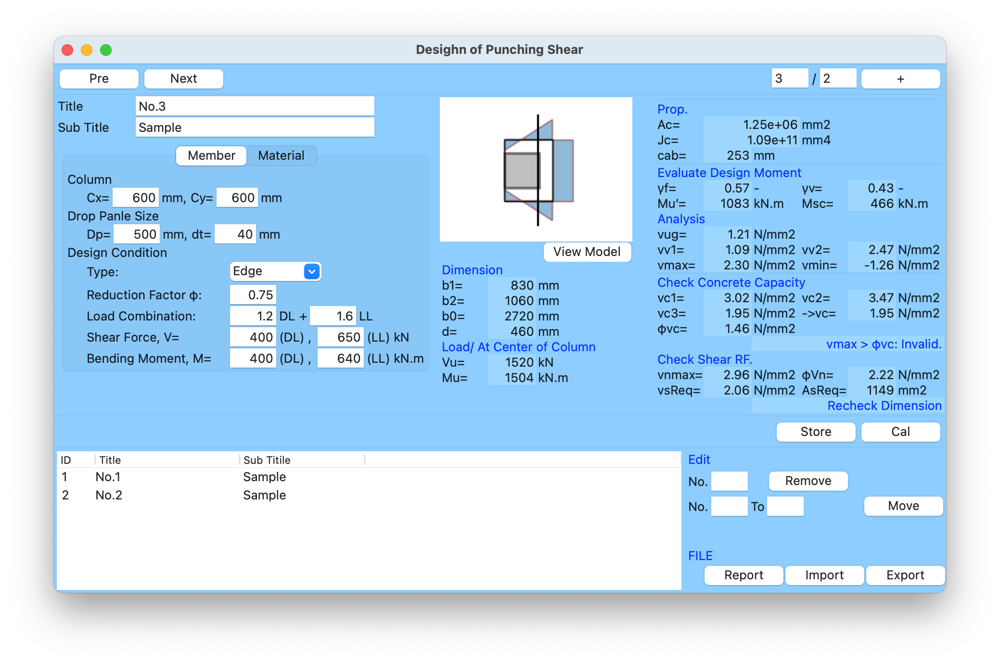

# Punch
 - estimate punching shear capacity by ACI code
 - under develop for cornner column. m(__)m


# Notation

## Propeties

``` text
------------------------------------------------------------------------
Ac   : Area at critical section = b0 x d,    mm2
Jc   : Porlar Moment of Inersia,             mm4
cab  : Center of Propeties                   mm
```


## Design Moment
``` text
------------------------------------------------------------------------
γf   = 1.0 / ( 1.0 + 2/3 √(b1/b2) )
 -- b1 > b2
γv   = 1.0 - γf
Mu'  = Mu - Vu x ( b1/2 + d/2 - cab )       kN.m
Msc  = γv x Mu'                             kN.m
```

## Analyisis

``` text
------------------------------------------------------------------------
vug  = Vu / Ac                             N/mm2
vv   = Σ Msc x cab / Jc                    N/mm2
vmax,vmin : Max{ vug + vv )                N/mm2
```

## Concrete Capacity
``` text
------------------------------------------------------------------------
vc1  = 0.17 x ( 1 + 2/β ) x √(fc)          N/mm2
 β = b1/b2 ( b1 > b2 )
vc2  = 0.0083( 2 + αs )                    N/mm2
 Internal    : αs = 40
 Edge        : αs = 30
 Cornner     : αs = 20
vc3  = 0.33 x √(fc)                        N/mm2
vc   = min{ vc1, vc2, vc3 }                N/mm2
```

## Shear Reinforcement
``` text
------------------------------------------------------------------------
vnmax = 0.5 x √(fc)                        N/mm2
vc    = 0.17 x √fc                         N/mm2
Req(vs) = ( vnmax - φ x vc ) /φ            N/mm2
Req(As) = (Req(vs) x s )/fy                  mm2
```

# For Windows
By power shell
``` DOS
> pyinstaller main.py --onefile --noconsole --icon=icons/twoWay_Icon.ico
> mv ./images ./dist/main/
> mv ./fonts ./dist/main/
> ./dist/main/main.exe
```
